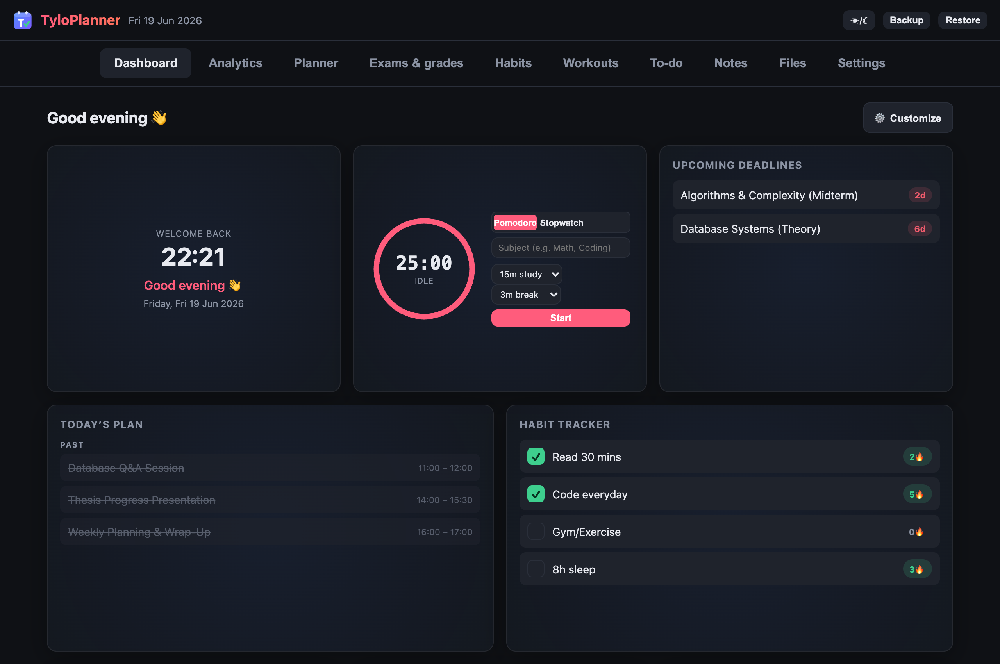
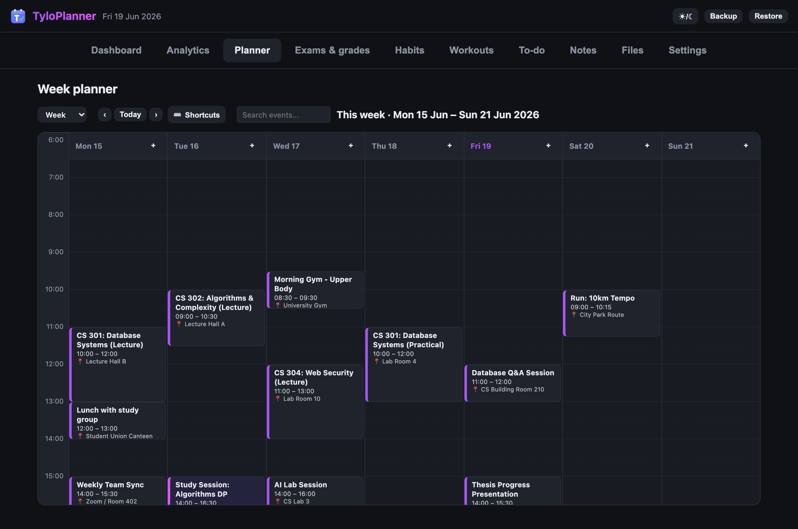
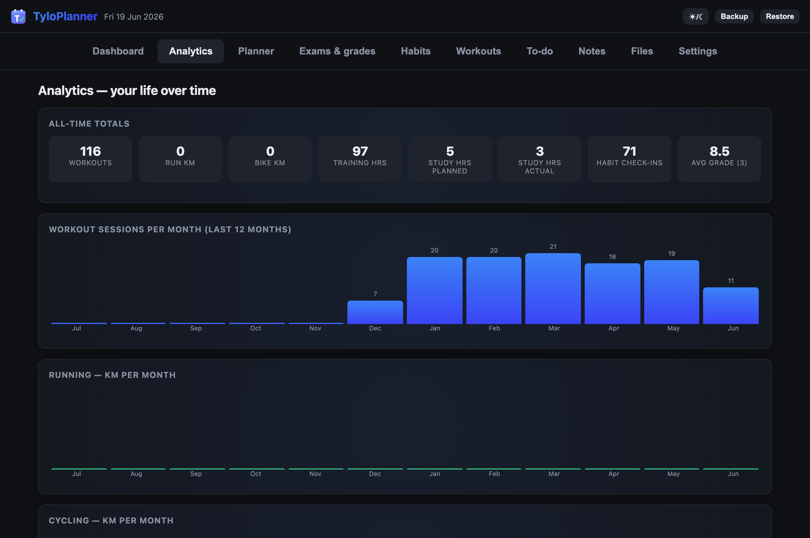
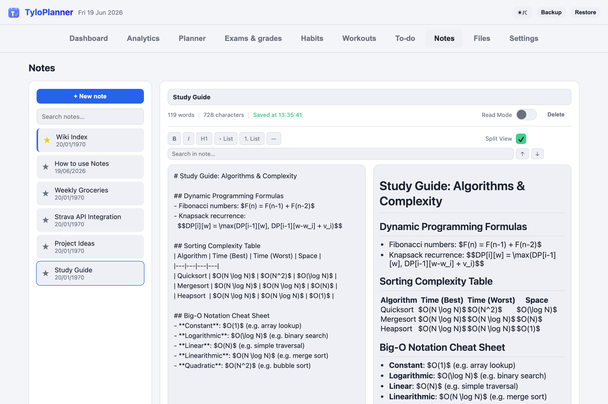
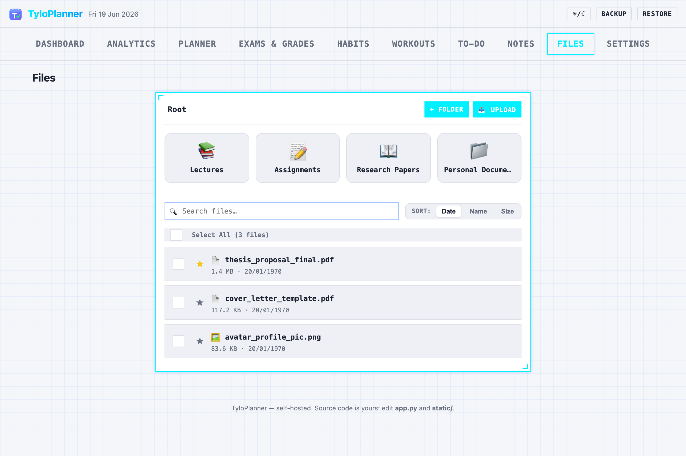
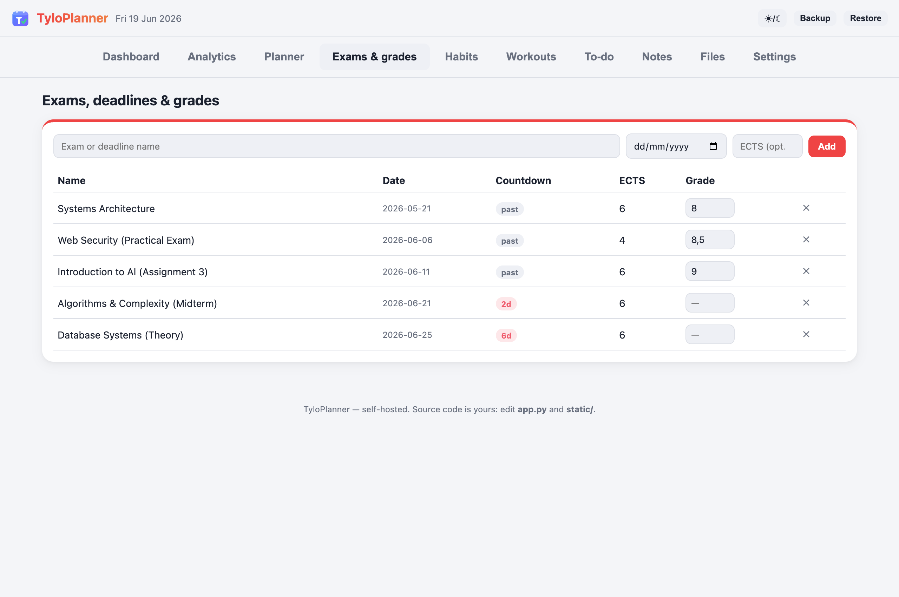
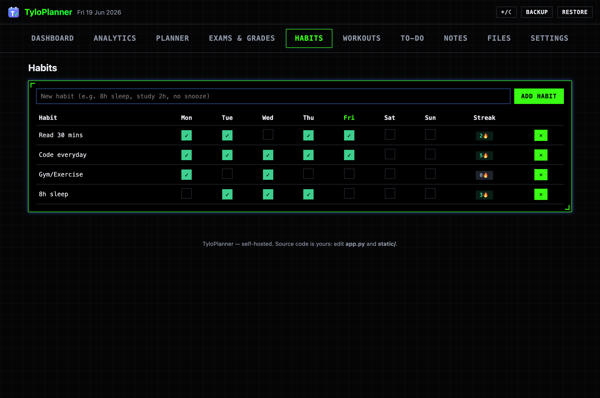
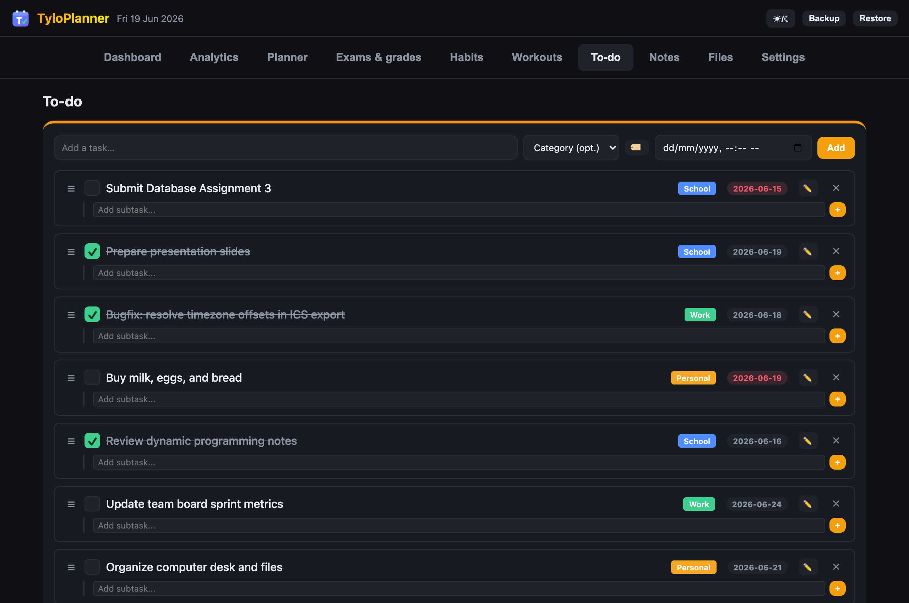
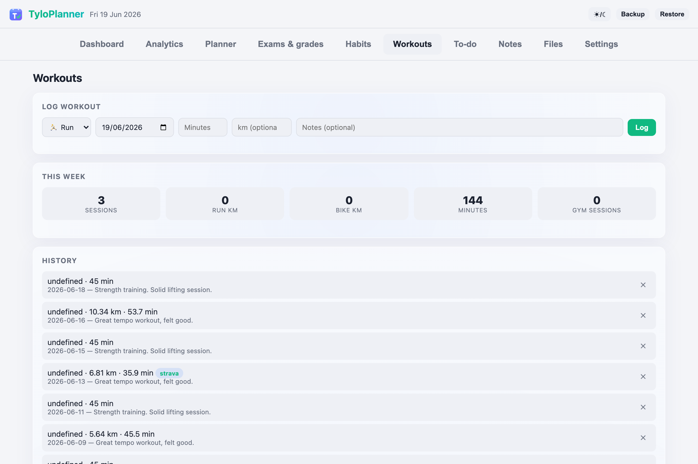

<p align="center">
  
</p>

<h1 align="center">TyloPlanner</h1>

<p align="center">
  A self-hosted personal dashboard for students.<br>
  Week planner · exams & grades · habits · workouts · analytics — on your own server, with your own data.
</p>

<p align="center">
  
  
  
  
</p>

---

## Preview

### 🎨 Modular Dashboard (Dark Theme / Glassmorphism Style)
<p align="center">
  
</p>

### 📅 Week Planner (Dark / Default Style) & 📊 Analytics Dashboard (Dark / Glass Style)
<p align="center">
  
  
</p>

### 📝 Notes Split-Editor (Light / Default Style) & 📁 File Manager (Light / Cyberpunk Style)
<p align="center">
  
  
</p>

### 🎓 Exams & Grades (Light / Material Style) & ⚡ Habit Tracker (Dark / Cyberpunk Style)
<p align="center">
  
  
</p>

### 📋 To-Do & Task List (Dark / Material Style) & 🏃 Workout Log (Light / Glass Style)
<p align="center">
  
  
</p>

---

## Why TyloPlanner?

Most planner apps want a subscription, your data, or both. TyloPlanner is a
single lightweight container you run yourself: no accounts, no tracking, no
cloud. Everything lives in one SQLite file on your machine, and the whole
codebase is under 20,000 lines of clean, modular code, making it easy to understand in a weekend and make your own.

## Features

- **Dashboard** — today's plan, habits, upcoming deadlines, weekly training, to-do list, and customizable website shortcuts (with custom ordering, toggling, and visibility) at a glance.
- **Week planner** — drag-and-drop event scheduling, drag-to-select for scheduling custom time ranges, interactive event resizing, automatic scrolling to the current time, location pins, and a smart overlapping layout (greedy interval-clustering). Supports subscribing to/exporting a built-in calendar feed.
- **Calendar auto-sync** — keep your schedule up to date by syncing university timetables or other shared calendar feeds (iCal URLs) at configurable intervals. Automatically parses event locations and descriptions, and offsets UTC/timezone-aware dates to match the server's local timezone.
- **Exams & grades** — countdowns to every exam, ECTS-weighted grade point average tracking, and task/exam reminders.
- **Habits** — check off daily habits, track completion streaks, and receive automated evening nudges for incomplete items.
- **Workouts** — log runs, rides, and gym sessions manually or sync them automatically with **Strava** integration.
- **Study Timer & Pomodoro Tracker** — Alpine.js circular countdown timer and stopwatch, customizable study/break intervals, active subject tracking, audio chime alerts, state persistence, and logs.
- **Advanced Task Management** — organize tasks using custom categories with styled color tags, drag-and-drop prioritization, subtask checklists, and datetime-local due date/time fields.
- **Notes Editor** — compose rich notes with `marked.js` markdown rendering, wiki-style cross-links (`[[Note Title]]`), a dual-pane split editor layout, real-time word/character count, per-note layout persistence, and debounced background autosaving.
- **File Manager** — upload documents/images via a full-screen drag-and-drop upload zone, preview media inline, organize with nested directories and breadcrumb navigation, and manage files in bulk.
- **Analytics** — 12-month visual history of workouts, distance, study hours (from actual logged sessions), and habit consistency, plus all-time totals.
- **Keyboard shortcuts** — navigate swiftly across tabs and weeks with customizable global hotkeys (`t`, `w`, `d`, `m`, `n`, `p`, `c`) and a visual key customization modal.
- **Theming & Customization** — toggle dark/light modes, choose from Glassmorphism, Flat, or a polished Cyberpunk retro-neon aesthetic (with a retro-grid Light Mode overhaul), and personalize the UI with a persistent custom accent color picker.
- **Notifications** — morning agendas (including overdue/upcoming tasks), evening habit nudges, and exam alerts pushed directly to your phone via [ntfy](https://ntfy.sh) or natively through browser **Web Push notifications** (using programmatic VAPID keys).
- **Mobile app (PWA) & Offline Sync** — install as a PWA for a fullscreen mobile experience. Touch-friendly swipe gestures let you delete notes or complete tasks, floating action buttons (FABs) provide quick entry shortcuts, and a phone camera capture option lets you upload photos directly to the File Manager. IndexedDB offline sync queues your actions while offline and replays them automatically when your connection is restored.

- **Secure & Resilient** — session-based authentication, optional TOTP two-factor authentication (2FA), nightly automated database backups, and one-click restore directly from the settings panel.

## Quick start

Requires [Docker](https://docs.docker.com/engine/install/) with the compose plugin.

```bash
git clone https://github.com/xdTYLOOFANCY/tyloplanner.git
cd tyloplanner
cp .env.example .env
nano .env                   # set AUTH_PASSWORD to your own password here
docker compose up -d --build
```

Open **http://localhost:8000** and sign in:

- **Username:** `admin` (that's the `AUTH_USERNAME` default in `.env`)
- **Password:** whatever you set as `AUTH_PASSWORD` in `.env`

Forgot what you set? Your credentials are always visible with
`grep AUTH_ .env`. To change them, edit `.env` and run
`docker compose up -d --build` again.

Installing on a real server? The **[install guide](docs/install.md)** has a
one-command setup for Ubuntu, plus HTTPS and VPN options.

## Documentation

| Guide | What's inside |
|---|---|
| **[Install guide](docs/install.md)** | One-command Ubuntu install, updating, running without Docker, exposing to the internet safely |
| **[Configuration](docs/configuration.md)** | Every `.env` option, authentication & 2FA, backups and restore |
| **[Integrations](docs/integrations.md)** | Calendar import/export/auto-sync, ntfy notifications, Strava sync |
| **[Development](docs/development.md)** | Architecture, project layout, API reference, adding your own features |

## Project structure

```
tyloplanner/
├── app.py              # application entry point & app factory
├── helpers.py          # config, database init, generic helpers
├── scheduler.py        # background jobs (auto-sync, backups, notifications)
├── blueprints/         # Flask routes per feature (auth, api, calendar, etc.)
├── static/             # frontend files
│   ├── index.html      # app shell
│   ├── app.js          # main UI entry point (wires modules to window)
│   ├── js/             # UI modules per feature (ES modules)
│   ├── style.css       # theming (dark/light, custom accent)
│   ├── login.html      # sign-in + 2FA page
│   └── sw.js           # PWA service worker
├── docs/               # user & developer guides
├── docker-compose.yml
├── Dockerfile
└── .env.example        # copy to .env and edit
```

Tech stack: **Flask · SQLite · vanilla JavaScript · Docker**. No frontend
framework, no build step, no external database — clone, edit, refresh.

## Contributing & security

Bug reports and pull requests are welcome — see
[CONTRIBUTING.md](CONTRIBUTING.md). For security issues, please read
[SECURITY.md](SECURITY.md) before opening a public issue.

## License

[GPLv3](LICENSE)
